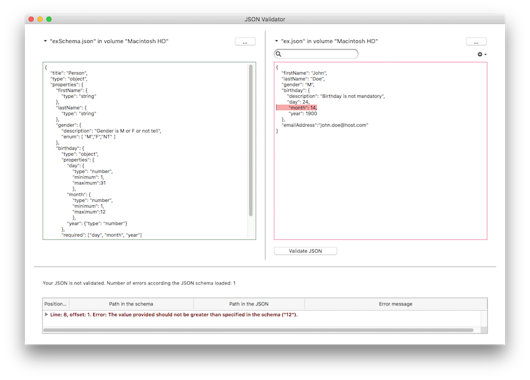

# 4DPop JSON Validator

4D v16 R4 introduces a new command: [JSON Validate](https://doc.4d.com/4Dv17/4D/17.4/JSON-Validate.301-4882819.en.html). This command allows you to verify that a JSON document is “valid” according to your JSON schema.

This is really useful for exchanging information between servers or between a server and its client. Thanks to JSON schema standards, you can define a “protocol” for communication with your server or an external server. More details can be found in this blog post.

We use this new command internally at 4D SAS to validate our own JSON files, mainly for unit testing purposes. Instead of having each developer creating their own tools to validate their JSON files, we’ve created a simple tool to validate a JSON file according to a given JSON schema. This tool provides a user-friendy interface to select your JSON schema and your JSON file to validate. It also helps you to quickly see where the issues are. In fact, a list of potential errors are displayed in a listbox; and when you click on an error, the JSON text concerned is highlighted directly in the file content.

We think this tool can be useful for you as well, so we decided to share it with you:

Below is a quick example to show you what this is all about. On the left, we have a JSON schema example and on the right, the JSON file to validate with the rules given in the schema on the left.

JSON Validator interface with a non-valid JSON

